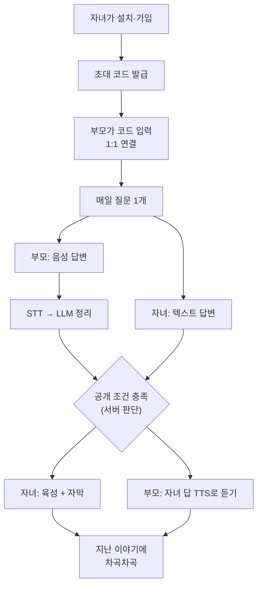
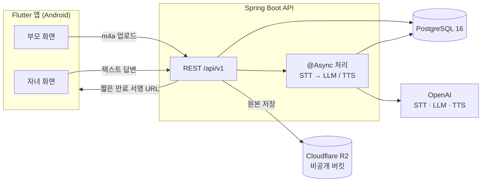
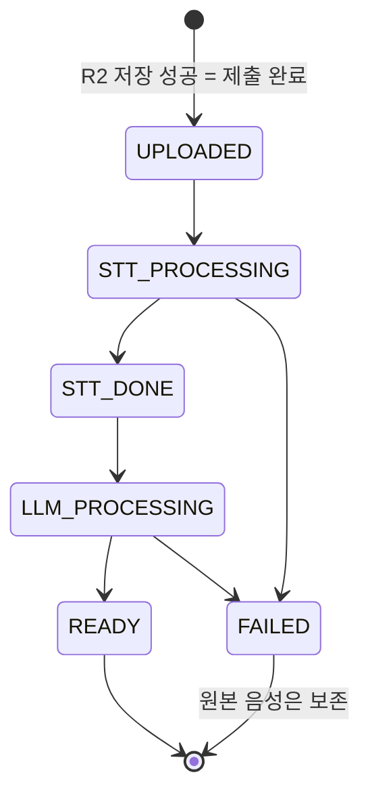

<div align="center">

# 삶을 기록해주는 AI (가제)

**부모님과 하루 한 질문, 답은 목소리로.**

부모와 자녀를 1:1로 잇고, 매일 같은 질문에 부모는 말로 · 자녀는 글로 답합니다.<br/>
부모님의 육성은 그대로 보존되고, 해가 지나면 한 사람의 목소리로 된 기록이 남습니다.


[소개](#소개) · [왜 만드는가](#왜-만드는가) · [핵심 아이디어](#핵심-아이디어-가족-썸원) · [기능](#기능) ·
[아키텍처](#시스템-아키텍처) · [시작하기](#시작하기) · [API](#api-한눈에-보기) · [팀](#팀) · [로드맵](#일정과-로드맵)

</div>

> [!NOTE]
> APPTIVE 26-1 · 4팀(앱팀) 프로젝트입니다. 서비스명은 아직 가제이며, **MVP 프로토타입 마감은
> 2026-10-02**, 정식 출시 목표는 **2026년 12월 초**입니다.

---

## 목차

- [소개](#소개)
- [왜 만드는가](#왜-만드는가)
- [핵심 아이디어: 가족 썸원](#핵심-아이디어-가족-썸원)
- [사용자 흐름](#사용자-흐름)
- [기능](#기능)
- [기존 서비스와의 차이](#기존-서비스와의-차이)
- [시스템 아키텍처](#시스템-아키텍처)
- [기술 스택](#기술-스택)
- [저장소 구조](#저장소-구조)
- [시작하기](#시작하기)
- [API 한눈에 보기](#api-한눈에-보기)
- [팀](#팀)
- [일정과 로드맵](#일정과-로드맵)
- [협업 규칙](#협업-규칙)
- [리스크와 열린 질문](#리스크와-열린-질문)
- [참고 자료](#참고-자료)

---

## 소개

자녀가 앱을 설치하고 초대 코드로 부모님을 연결합니다. 그러면 매일 같은 질문이 두 사람에게
도착합니다. "어릴 때 가장 좋아했던 놀이는 무엇이었나요?" 같은 질문입니다.

| | 부모님 | 자녀 |
|---|---|---|
| 답하는 방법 | 녹음 버튼 하나로 **30~60초 말하기** | 텍스트로 답하기 |
| 받는 것 | 자녀의 답을 **AI 음성으로 듣기** | 부모님 **육성 그대로** + 정리된 자막 |
| 남는 것 | 내 삶의 이야기가 기록으로 쌓임 | 부모님의 목소리로 된 기록 |

두 사람이 모두 답하면 서로의 답이 공개됩니다. 부모님의 음성은 STT(음성 인식)와 LLM 정리를
거쳐 읽기 쉬운 자막으로 함께 제공되지만, **기록의 정본은 언제나 원본 음성**입니다.

---

## 왜 만드는가

### 1. 부모님의 이야기는 기록되지 않은 채 사라진다

한국은 2024년 12월 23일 65세 이상 주민등록 인구가 **1,024만 명, 전체의 20.00%** 를 넘어
초고령사회에 진입했습니다.<sup>[1]</sup> 국가데이터처는 이 비중이 2036년 30%, 2050년 40%를
넘을 것으로 전망합니다.<sup>[2]</sup> 65세 이상 고령자 가구 가운데 가장 많은 유형은
**1인 가구(37.8%)** 입니다.<sup>[3]</sup>

부모와 자녀가 떨어져 사는 것이 기본값이 된 지금, 부모님의 어린 시절이나 젊은 날의 이야기는
따로 묻지 않으면 들을 기회가 거의 없습니다.

### 2. 글쓰기는 부모 세대에게 높은 벽이다

2024년 디지털정보격차 실태조사에서 고령층의 디지털정보화 수준은 **71.4%** 로, 장애인·
저소득층·농어민을 포함한 4대 취약계층 가운데 가장 낮았습니다.<sup>[4]</sup>

기존 가족 질문 앱은 대부분 **글로 답하는** 방식입니다. 휴대폰으로 긴 글을 입력하는 일은
부모 세대가 가장 먼저 포기하는 지점입니다. 그래서 이 서비스는 부모님에게 **말하기만** 요구합니다.

### 3. 회상은 연구된 활동이다. 다만 우리는 치료 앱이 아니다

과거를 떠올려 이야기하는 활동(회상, reminiscence)은 노년기 심리학에서 오래 연구된 주제입니다.

- 우울 증상이 있는 60세 이상 3,361명이 참여한 42개 연구를 종합한 2024년 메타분석은 회상·
  생애 회고 치료가 우울 증상을 줄이는 **큰 효과(g = 1.41)** 를 보고했습니다. 다만 연구의
  질이 고르지 않고, 출판 편향을 보정하면 추적 시점의 효과는 유의하지 않았습니다.<sup>[5]</sup>
- 치매 환자 1,972명(22개 연구)을 다룬 코크란 리뷰는 효과가 **작고 일관되지 않으며** 환경에
  따라 크게 다르다고 결론지었습니다.<sup>[6]</sup>

이 연구들은 전문가가 이끄는 개입을 다룹니다. 이 앱은 의료·치료 서비스가 아니며, 대외
문구에서 치료 효과를 주장하지 않습니다([리스크](#리스크와-열린-질문) 참고).

---

## 핵심 아이디어: 가족 썸원

커플 질문 앱 **썸원(SumOne)** 은 "매일 같은 시간 질문 하나, 둘 다 답해야 서로의 답이 열린다"는
단순한 구조로 전 세계 1,000만 명의 연인이 쓰는 서비스가 되었습니다.<sup>[7]</sup> 상대의 답이
궁금해서 내가 답하고, 답이 잠겨 있으니 상대에게 말을 건넵니다. 앱이 아니라 **사람이 사람을
부르는** 구조입니다.

이 구조를 부모와 자녀에게 옮깁니다. 하지만 연인과 달리 부모·자녀는 **비대칭**입니다. 디지털
숙련도도, 하루의 리듬도, 서로에게 거는 기대도 다릅니다. 그래서 그대로 옮기지 않고 네 가지
원칙으로 고쳤습니다.

| 원칙 | 커플 앱에서는 | 가족에게 그대로 쓰면 | 그래서 이렇게 한다 |
|---|---|---|---|
| **자녀 쪽은 막지 않는다** | 미답이면 다음 질문이 잠겨 서로 재촉 | 부모님께 "빨리 해"라는 압박이 된다 | 부모가 답을 밀려도 자녀 앱은 잠기지 않는다 |
| **끊김을 보여주지 않는다** | 연속 기록이 자랑거리 | 연속 끊김이 불효 알림이 된다 | 쌓인 기록은 보여주되 "연속 끊김"은 표시하지 않는다 |
| **부모의 진입 비용을 없앤다** | 짧은 글자 수 제한이 부담을 줄인다 | 타이핑 자체가 벽이다 | 녹음 버튼 하나, 최소 길이 없음, 30~60초 기준 |
| **원본 음성이 정본이다** | 텍스트가 기록의 전부 | AI가 다듬은 글은 부모님 말이 아닐 수 있다 | 육성을 기본으로 재생하고 정리 텍스트는 보조로만 쓴다 |

---

## 사용자 흐름



상대 답변을 언제 공개할지(둘 다 답해야 하는지, 일정 시간 뒤 한쪽만 공개할지 등)는
**서버가 계산**합니다. 앱은 서버가 내려준 `revealStatus`만 보고 화면을 그립니다. 세부 정책은
2026-09-25 회의에서 확정합니다.

---

## 기능

### MVP (2026-10-02)

**성공 기준: 핵심 루프 하나가 두 사람 사이에서 끝까지 동작한다.**

| ID | 기능 | 설명 |
|---|---|---|
| FR-12 | 온보딩·계정 | 이름과 역할(부모/자녀)로 간편 가입, access token 발급 |
| FR-17 | 초대 코드 연결 | 자녀가 6자리 코드 발급(24시간·1회용) → 부모 입력 → 1:1 페어 |
| FR-01 | 질문 제공 | 날짜별 질문 1개 배정, 앱을 열면 그날의 질문 표시. 카테고리: 유년시절, 학교, 부모님, 동네, 그 시절 등 |
| FR-22 | 질문 음성 안내 | 질문 등록 시 TTS를 미리 만들어 캐싱 → 런타임 비용 거의 0 |
| FR-02 | 음성 녹음 | m4a(AAC), 1~60초, 최대 10MiB. 공개 전까지 다시 녹음 가능 |
| FR-08 | 원본 아카이빙 | 비공개 저장소에 원본 보관, 짧은 만료 시간의 서명 URL로만 재생 |
| FR-03 | STT | 음성 → 텍스트. 모듈 인터페이스로 추상화해 교체 가능 |
| FR-04 | LLM 정리 | 문장만 다듬고 **원문에 없는 사실·날짜·지명·감정을 추가하지 않음** |
| FR-19 | 자녀 텍스트 답변 | 1~1000자, 공개 전까지 수정 가능. 자녀는 글로만 답한다 |
| FR-18 | 공개 게이트 | 서버가 공개 여부 계산. 자녀 쪽 차단 없음 |
| FR-21 | 자녀 답변 낭독 | 자녀의 글을 TTS로 부모님께 읽어드림 (TTS의 1순위 용도) |
| FR-06 | 큰 자막 | MVP는 전체 텍스트를 큰 글씨로 한 번에 표시 |
| FR-23 | 부모용 단순 화면 | 큰 글씨, 높은 대비, 한 화면에 주요 행동 하나 |
| FR-07 | 지난 이야기 | 공개된 이야기를 최신순으로 모아 보기 |

### 재생 트랙

| 트랙 | 내용 | 기본값 |
|---|---|---|
| 원본 음성 | 부모님 육성 + STT 자막 | **기본** |
| 정리본 음성 | LLM 정리 텍스트를 TTS로 낭독 | 선택 (음질·사투리로 알아듣기 어려울 때) |

### MVP에서 일부러 뺀 것

- **정해진 시각의 질문 알림(FR-20)** 은 서버 스케줄러와 푸시(FCM) 연동이 필요해 P1로 미룹니다.
  MVP의 성공 기준은 두 사람 사이에서 루프가 끝까지 도는 것이고, 그 검증에는 알림이 필요하지
  않습니다. 대신 매일의 리듬을 만드는 핵심 장치라 P1의 첫 번째 항목입니다.
- **자녀의 음성 답변**은 넣지 않습니다. 자녀 세대에게 타이핑은 부담이 아니고, 자녀의 글은
  TTS로 부모님께 읽어드립니다. "부모는 말로, 자녀는 글로"라는 비대칭 설계를 그대로 유지합니다.

### MVP 이후

| 단계 | 기능 |
|---|---|
| P1 | **정해진 시각 질문 알림(FR-20)**, 처리 완료 알림, 연간 아카이브(책·음성 앨범), 상속·보존 정책, 전화번호 인증·계정 복구, 자막 실시간 동기화 |
| P2 | 여러 질문으로 나눠 답하는 멀티 질문형, 사투리 인식 튜닝, 질문 추천 |
| 보류 | 소셜 피드, 다른 사람 이야기를 듣고 이어 말하는 연쇄 기록 |

---

## 기존 서비스와의 차이

| 서비스 | 대상 | 주기 | 답하는 방식 | 상호 공개 | 결과물 |
|---|---|---|---|---|---|
| [썸원](https://www.sumone.co/ko/) | 연인 | 매일 | 글 | ✅ | 커플 다이어리 |
| [하루한질문](https://play.google.com/store/apps/details?id=com.dailyfamilyquestion.daily_family_question&hl=ko) | 가족 그룹 | 매일 | 글 | ✅ (전원 답해야) | 답변 캘린더 |
| [StoryWorth](https://welcome.storyworth.com/) | 부모님 (자녀가 선물) | 매주 이메일 | 글, 전화 녹음(상위 요금제) | ❌ | 1년 뒤 책 ($59~) |
| [Remento](https://www.remento.co/) | 부모님 (자녀가 선물) | 매주 | 음성·영상 → AI 정리 | ❌ | 원본 음성 QR이 담긴 책 ($99/년) |
| **이 서비스** | **부모 ↔ 자녀 1:1** | **매일** | **부모 음성 · 자녀 글** | ✅ (서버 정책) | **목소리 아카이브** |

솔직하게 말하면, **음성 녹음 + AI 정리 + 원본 보존**은 Remento가 이미 하고 있습니다. 이
서비스의 차이는 세 가지입니다.

1. **매일의 리듬.** 주 1회 회고록이 아니라 하루 한 번의 대화입니다.
2. **양방향.** 부모만 답하는 인터뷰가 아니라 자녀도 같은 질문에 답합니다. 부모님도 자녀의
   이야기를 듣습니다.
3. **한국어 시니어 UX.** 국내 가족 질문 앱은 아직 작고(하루한질문 다운로드 10회 이상, 2026년
   9월 기준) 모두 글 입력 기반입니다.

---

## 시스템 아키텍처



### 녹음 처리 파이프라인

녹음은 업로드 즉시 `202 Accepted`로 응답하고, AI 처리는 비동기로 진행합니다. 앱은 처음 30초는
3초, 이후 5초 간격으로 상태를 조회하고 60초가 지나면 "처리 중" 화면으로 전환합니다.



**AI가 실패해도 가족의 답변은 막히지 않습니다.** 원본이 저장되면 제출은 이미 완료된 것이고,
STT나 LLM이 실패하면 자막 없이 원본 음성만 공개하며 안내 문구를 함께 보여줍니다.

### 설계 원칙

- **공개 정책은 서버에만 있다.** 앱은 `revealStatus`와 `canViewPartnerAnswer`만 사용하고
  공개 조건을 스스로 계산하지 않습니다.
- **음성 URL은 저장하지 않는다.** DB에는 R2 object key만 두고, 조회할 때마다 짧게 만료되는
  서명 URL을 만듭니다.
- **로그에 민감 정보를 남기지 않는다.** 토큰, STT 원문, 서명 URL의 query는 기록하지 않습니다.
- **pairId는 클라이언트가 보내지 않는다.** 서버가 인증된 사용자로부터 찾고, 모든 요청에서
  구성원인지 다시 검사합니다.

---

## 기술 스택

| 영역 | 기술 |
|---|---|
| 앱 | Flutter 3.47.5 (Dart), Android 전용 · `flutter_riverpod` · `go_router` · `dio` · `flutter_secure_storage` |
| 녹음·재생 | `record` (m4a/AAC-LC, 최대 60초) · `just_audio` |
| 서버 | Spring Boot 3.5.16, Java 17, Spring Web · Validation · Data JPA · Security |
| 인증 | JWT (JJWT 0.12.6, HS256), access token 30일(MVP) |
| DB | PostgreSQL 16 (개발: Docker / 출시: AWS RDS) |
| 음성 저장소 | Cloudflare R2 (S3 호환). 반복 청취가 많은 서비스라 전송(egress) 요금이 없는 점을 고려 |
| AI | OpenAI 단일 벤더: STT `gpt-transcribe` · 정리 `gpt-5-mini` · TTS `gpt-4o-mini-tts` |

---

## 저장소 구조

```text
4team/
├── README.md              ← 이 파일
├── AGENTS.md              ← 프로젝트 공통 규칙 (반드시 먼저 읽기)
├── CLAUDE.md              ← Claude Code 진입점 (AGENTS.md를 불러옴)
├── docs/
│   └── api-contract.md    ← API 요청·응답·상태값의 단일 기준
├── frontend/              ← Flutter 앱
│   ├── AGENTS.md          ← Flutter 규칙, 화면별 담당, 프론트 일정
│   ├── README.md          ← 설치·실행·Mock 전환
│   ├── assets/mocks/      ← API 계약 예시 JSON
│   └── lib/
│       ├── app/           ← 라우터
│       ├── core/          ← 네트워크, 토큰 저장, 테마, 공통 위젯
│       └── features/      ← 화면 단위 기능 (data / domain / presentation)
└── backend/               ← Spring Boot API
    ├── AGENTS.md          ← 서버 구현 규칙과 작업 순서
    ├── README.md          ← 로컬 실행·환경변수
    └── src/main/java/com/apptive/backend/
        ├── common/        ← 인증, 보안 설정, 공통 예외
        └── domain/        ← user, pair, question, assignment, …
```

**읽는 순서**: 이 README → [`AGENTS.md`](AGENTS.md) → [`docs/api-contract.md`](docs/api-contract.md)
→ 역할에 맞는 [`frontend/AGENTS.md`](frontend/AGENTS.md) 또는 [`backend/AGENTS.md`](backend/AGENTS.md).

---

## 시작하기

### 요구 사항

| 영역 | 필요 |
|---|---|
| 백엔드 | JDK 17, Docker / Docker Compose (Gradle은 Wrapper 사용) |
| 프론트 | Flutter 3.47.5 stable, Android SDK + NDK `28.2.13676358`, 에뮬레이터 또는 실기기 |

### 백엔드

```bash
cd backend
cp .env.example .env          # 값 채우기 (API 키 등은 팀 비공개 채널에서 공유)
docker compose up -d          # PostgreSQL 16 (5432)
set -a; source .env; set +a   # Spring Boot는 .env를 자동으로 읽지 않음
./gradlew bootRun             # http://localhost:8080
```

```bash
curl http://localhost:8080/api/v1/health   # {"status":"UP", ...}
```

환경변수, 자주 겪는 문제는 [`backend/README.md`](backend/README.md)를 참고하세요.

### 프론트엔드

```bash
cd frontend
flutter pub get
flutter run                   # 기본값은 Mock 모드: 백엔드 없이 assets/mocks/ 로 실행
```

실제 백엔드에 연결할 때는 `--dart-define`으로 주소를 넘깁니다.

```bash
# Android 에뮬레이터에서 개발 PC의 localhost 는 10.0.2.2
flutter run --dart-define=USE_MOCK=false --dart-define=API_BASE_URL=http://10.0.2.2:8080/api/v1
```

Android Studio 설정, Mock 데이터 목록, 자주 겪는 문제는 [`frontend/README.md`](frontend/README.md)를
참고하세요.

### PR 전 확인

```bash
cd frontend && dart format . && flutter analyze && flutter test
cd backend && ./gradlew test
```

---

## API 한눈에 보기

Base URL `/api/v1` · 인증 `Authorization: Bearer {accessToken}` · 전체 명세는
[`docs/api-contract.md`](docs/api-contract.md)

| 메서드·경로 | 누가 | 용도 | 구현 (09-24 기준) |
|---|---|---|---|
| `GET /health` | 누구나 | 서버 상태 확인 | ✅ |
| `POST /users` | 누구나 | 간편 가입, access token 발급 | ✅ |
| `POST /pairs/invitations` | 자녀 | 초대 코드 발급 | ✅ |
| `POST /pairs/join` | 부모 | 초대 코드로 연결 | ✅ |
| `GET /today` | 공통 | 오늘 질문·제출·공개 상태 | 🟡 뼈대 (제출 상태 미반영) |
| `PUT /assignments/{id}/parent-recording` | 부모 | 녹음 제출·교체 (multipart) | ⬜ |
| `GET /recordings/{id}` | 부모 | STT·LLM 처리 상태 폴링 | ⬜ |
| `PUT /assignments/{id}/child-answer` | 자녀 | 텍스트 답변 제출·수정 | ⬜ |
| `GET /answers/{id}/audio` | 부모 | 자녀 답변 TTS 상태·재생 URL | ⬜ |
| `GET /stories` | 공통 | 공개된 지난 이야기 (cursor 페이지네이션) | ⬜ |

모든 에러는 같은 형식(`errorCode`, `message`, `traceId`, `fieldErrors`)으로 내려가며, 앱은
HTTP 문구가 아니라 `errorCode`와 상태 enum으로 화면을 나눕니다.

---

## 팀

| 역할 | 이름 | 담당 |
|---|---|---|
| PO·기획 | 윤서현 | 기획서, 질문 세트, 정책 |
| 디자인 | 장은우 | UI 디자인 |
| 백엔드 | 제수지 (테크리드) | 인증·페어링·질문 배정, 서버 구조 |
| 프론트 A | 박강현 | 가입·페어링·오늘 홈, 첫 화면 분기 |
| 프론트 B | Yin Min Aye (인민에이) | 부모 화면: 녹음·업로드·처리 상태, 자녀 답변 듣기, 공통 오디오 위젯 |
| 프론트 C | 정우영 | 공통 기반, 자녀 화면: 답변 작성·공개 화면, 지난 이야기 |

프론트 역할은 **화면을 보는 사람 기준**으로 나눴습니다. 자세한 범위와 담당 사이 합의 사항은
[`frontend/AGENTS.md`](frontend/AGENTS.md) 8장에 있습니다. 정기 회의는 매주 수요일 20시입니다.

---

## 일정과 로드맵

### MVP까지

| 날짜 | 마일스톤 |
|---|---|
| 9/24 | 저장소 세팅, API 계약 v0, 백엔드 인증·페어링·오늘 질문, 프론트 스캐폴드 |
| 9/25 | 공개 정책 확정 회의 · 가입·페어링·오늘 화면, 녹음 로컬 동작, 자녀 답변 (Mock) |
| 9/26 ~ 9/27 | 가입·페어링·오늘 실제 API 연동, 녹음 업로드·폴링, 자녀 답변 |
| 9/28 ~ 9/29 | 공개 답변 재생·자막·TTS, 지난 이야기, 전체 흐름 통합 |
| 9/30 | 실패·재시도·권한·백그라운드 복귀 테스트 |
| 10/1 | 접근성 QA, 실기기 통합, 데모 데이터 준비 |
| **10/2** | **MVP 프로토타입 시연** |

### 출시까지

| 기간 | 목표 |
|---|---|
| 10월 중 | 내부 테스트, STT·TTS 품질 검증(사투리 포함), 팀원 가족 실사용 2주로 리텐션 측정 |
| 11월 초 | 질문 세트 고도화, 자막 실시간 동기화 |
| 11월 중 | 연간 아카이브, 상속·보존 정책 |
| 11월 말 | QA, 스토어 등록 (심사 기간 1~2주 반영) |
| **12월 초** | **정식 출시** |

---

## 협업 규칙

- **`main`에 직접 push하지 않습니다.** 기능 하나당 브랜치 하나, PR 하나로 작게 유지합니다.
  - 브랜치 이름: `feature/<기능>`, `fix/<기능>`, `chore/<작업>`, `docs/<문서>`
  - 커밋: `feat:`, `fix:`, `chore:`, `docs:` 접두어
- **API 계약이 기준입니다.** 구현이 계약과 다르면 우회하지 말고 `[API]` GitHub Issue를 만든 뒤,
  계약 문서·백엔드 DTO·프론트 DTO와 Mock을 **같은 PR**에서 맞춥니다.
- **비밀 값을 커밋하지 않습니다.** `.env`, API 키, JWT secret, 실제 비밀번호, `.idea`,
  빌드 결과물은 올리지 않습니다.
- **완료 기준**: 테스트와 정적 분석 통과, loading·empty·error·retry 상태 확인, 로그에 토큰·
  개인정보·서명 URL query 없음.

자세한 규칙은 [`AGENTS.md`](AGENTS.md)에 있습니다.

---

## 리스크와 열린 질문

### 리스크

| 리스크 | 대응 |
|---|---|
| **LLM 각색**: 부모님이 하지 않은 말이 기록될 수 있음 | 프롬프트로 사실 추가 금지, 원본 음성을 항상 함께 제공 |
| **사투리·시니어 발화 인식률** | 팀원 가족 음성으로 실측, 필요하면 STT 교체(모듈 추상화) |
| **비대칭 이탈**: 부모가 멈추면 자녀도 멈춤 | 자녀 쪽 차단 없음, 부드러운 알림 |
| **효도 압박** | 연속 끊김·미응답을 재촉하는 연출 금지 |
| **부모님의 죽음·치매** | 아카이브 영구 보존과 저장소 삭제 정책을 출시 전에 설계 |
| **가족 갈등** | MVP는 1:1로 고정, 가족 그룹은 이후 |
| **효과 과장**: 회상 요법 문구의 광고 규제 | 치료·의료 효과를 대외 문구에 쓰지 않음 |
| **API 사용료** | STT→LLM→TTS가 이야기마다 발생. 녹음 길이가 30~60초로 줄어든 기준으로 비용 재계산 |

### 아직 정하지 않은 것

- 서비스명과 팀명
- 공개 정책 세부: 둘 다 답해야 공개할지, 일정 시간 뒤 한쪽만 공개할지, 건너뛰기 허용 여부,
  공개 후 수정 허용 여부 (**2026-09-25 회의**)
- 카테고리별 질문 세트와 담당자 (서비스의 핵심 자산)
- 수익 모델: 자녀 결제, 선물·연간 아카이브 구매 등

---

## 참고 자료

1. 경향신문, ["'65세 이상' 주민등록 인구 사상 첫 20%…한국, '초고령사회' 진입"](https://www.khan.co.kr/article/202412241119001), 2024-12-24 (행정안전부 발표, 2024-12-23 기준)
2. 국가데이터처, [「2025 고령자 통계」 보도자료](https://mods.go.kr/board.es?mid=a10301010000&bid=10820&tag=&act=view&list_no=438832&ref_bid=), 2025-09-29
3. 브라보마이라이프, ["[2025 고령자 통계] 12년 뒤 가장 많은 비중 차지할 연령대는?"](https://bravo.etoday.co.kr/view/atc_view/17445) (「2025 고령자 통계」 인용)
4. 더인디고, ["2024 실태조사 결과, '디지털 접근성은 개선, 스마트폰 과의존은 여전'"](https://theindigo.co.kr/archives/61549) (과학기술정보통신부 2025-03-27 발표, [보도자료](https://www.korea.kr/briefing/pressReleaseView.do?newsId=156681128))
5. Lin J, Zhao R, Li H, Lei Y, Cuijpers P. [Looking back on life: An updated meta-analysis of the effect of life review therapy and reminiscence on late-life depression](https://research.vu.nl/en/publications/looking-back-on-life-an-updated-meta-analysis-of-the-effect-of-li). *Journal of Affective Disorders*, 347, 163–174 (2024)
6. Woods B, O'Philbin L, Farrell EM, Spector AE, Orrell M. [Reminiscence therapy for dementia](https://www.cochrane.org/evidence/CD001120_reminiscence-therapy-dementia). *Cochrane Database of Systematic Reviews*, 2018(3)
7. SumOne, [공식 사이트](https://www.sumone.co/ko/) (사용자 수는 자사 발표)

경쟁 서비스 정보는 각 서비스의 공식 사이트와 Google Play 페이지를 2026-09-24에 확인했습니다.
가격과 사용자 수는 바뀔 수 있습니다.
